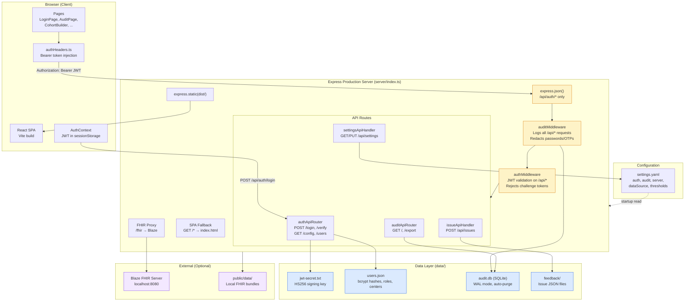
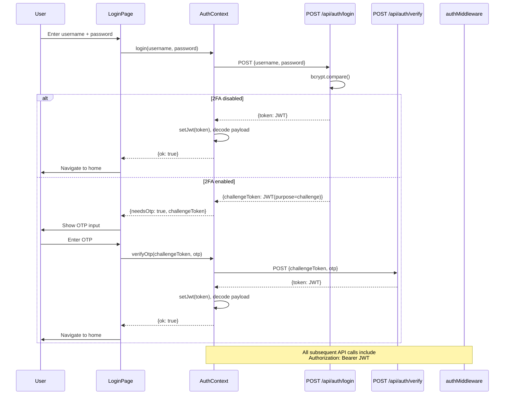
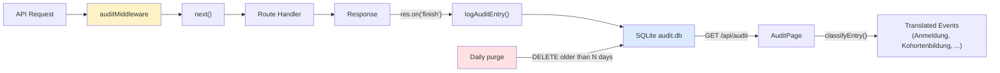

# EMD Architecture — After Phase 2

## System Overview



## Middleware Execution Order

```
Request → express.json(/api/auth/*) → auditMiddleware(/api/*) → authMiddleware(/api/*) → Route Handler → Response
                                              ↓                                                              ↓
                                        res.on('finish')  ──────────────────────────────────────→  logAuditEntry(SQLite)
```

1. **express.json** — Parses JSON body, mounted only on `/api/auth/*` (other handlers use `readBody()`)
2. **auditMiddleware** — Wraps response, logs on `finish` event with timing, user, status, redacted body
3. **authMiddleware** — Validates JWT Bearer token, rejects challenge-purpose tokens, skips public paths
4. **Route handler** — Processes request with `req.auth` guaranteed present

## Authentication Flow



## Audit Data Flow



## JWT Payload Structure

```json
{
  "sub": "admin",
  "preferred_username": "admin",
  "role": "admin",
  "centers": ["UKA", "UKB", "LMU", "UKT", "UKM"],
  "iat": 1712736000,
  "exp": 1712736600
}
```

- Signed with HS256 using secret from `data/jwt-secret.txt`
- 10-minute expiry
- Challenge tokens add `"purpose": "challenge"` (2-minute expiry, rejected by authMiddleware)

## File Layout (Runtime)

```
emd-app/
  data/                          # Created at first startup
    jwt-secret.txt               #   Auto-generated HS256 key (mode 0600)
    users.json                   #   User records with bcrypt hashes
    audit.db                     #   SQLite audit log (WAL mode)
  dist/                          # Vite production build output
  feedback/                      # Issue reports (JSON + screenshots)
  public/
    settings.yaml                # All configuration
    data/                        # FHIR test bundles
  server/
    index.ts                     # Express entry point
    initAuth.ts                  # JWT secret + user migration
    authMiddleware.ts            # JWT validation middleware
    authApi.ts                   # Login/verify/config/users routes
    auditDb.ts                   # SQLite database layer
    auditMiddleware.ts           # Request auto-logging
    auditApi.ts                  # Read-only audit API
    issueApi.ts                  # Issue reporting (+ Vite plugin)
    settingsApi.ts               # Settings CRUD (+ Vite plugin)
    utils.ts                     # readBody, sendError
```
